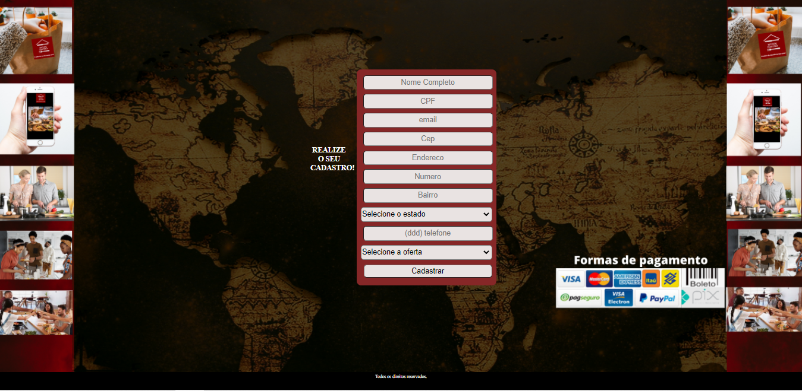

# Cadastro do cliente

Projeto desenvolvido durante a jornada do Hiring Coders. (Desafio 2)

Desenvolvimento de uma página de cadastro com dados de clientes, endereços e produtos devidamente estruturados. Dados armazenados no localstorage.

Esta página foi dada como sequência do [desafio 1](https://github.com/cunhac/landing_page_black_friday) no qual foi solicitado para o cliente o cadastro do email para receber a oferta da Black Friday. Agora no desafio 2 foram enviadas as ofertas das três opções de produtos da Mundi Gastrô com o formulário solicitando os dados cadastrais do cliente para a realização da compra.

link da página: https://cunhac.github.io/cadastro_cliente/index.html

<hr>

## Cadastro Cliente





<hr>

## Estrutura do repositório

```
|cadastro
|
├── assets
│   ├── backgroundOne.png
│   ├── backgroundTwo.png
├── css
│   └── style.css
|__ docs
!   |── primeira_cadastro.png
|   |── segunda_cadastro.png
├── js
│   └── script.js
├── index.html
└── readme.md
```

`assets`: estão armazenadas as imagens do plano de fundo da página das ofertas e da página do formulário.

`css`: consta o arquivo style.css aonde estão armazenadas as configurações referente a personalização da página.

`docs`: estão armazenadas as imagens da página para readme.

`js`: consta o arquivo script.js que tem o código responsável por fazer a interação com o localStorange. 

`index.html`: responsável pela estrutura da página.

